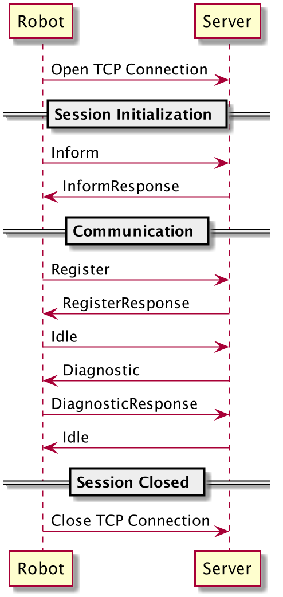

# 项目介绍
实现客户端与服务器端的双向通信
## 功能介绍
### 已完成功能
- 消息体的加密与解密
- 客户端向服务端发送心跳
### 待完成功能
- 服务器端向客户端发送消息
## 项目目录介绍
## 项目环境
JDK 1.8
## 运行指导
### IDE内运行
1. GitHub下载代码，并引入IDEA；
2. build项目，获取
3. 运行服务器端启动类，执行Server.java中的main方法；
4，运行客户端启动类，执行Client.java中的main方法；
### JAR运行
1. GitHub下载代码，并引入IDEA；
2. 打包项目，项目根路径下执行`mvn clean -DskipTests=true package`，可以看到生成了`robot_demo-1.0-SNAPSHOT.jar`；
4，jar包所在目录下运行`java -jar robot_demo-1.0-SNAPSHOT.jar server；即可启动服务器端，
3. jar包所在目录下运行`java -jar robot_demo-1.0-SNAPSHOT.jar client；即可启动客户端。
### 代码待改进处
0-1的过程，20h+的时间，比较仓促，有需要要改进的点，先记录备忘。
- 部分可修改参数统一使用配置文件管理
- 补充代码注释

## 注册流程

